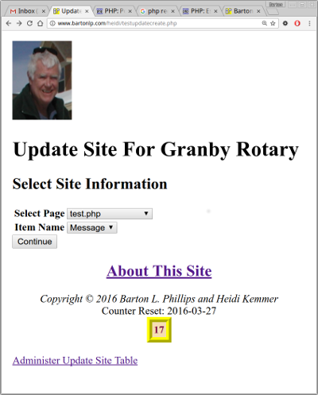
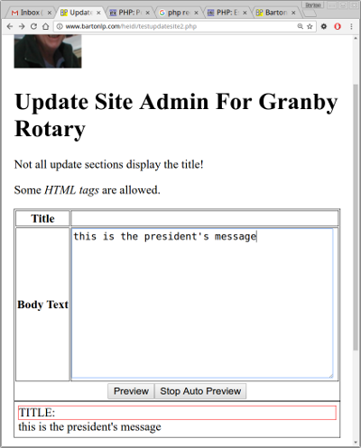
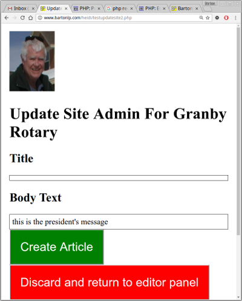

# UpdateSite Class

This is a PHP Class with a little JavaScript thrown in.

This class works with [SiteClass](https://github.com/bartonlp/site-class). **SiteClass** documentation can be found at [SiteClass Documentation](https://bartonlp.github.io/site-class).

The class can be used to insert sections into a website from a database. The sections can be edited and administered via the web.

**This is still a work in progress and is not stable.**

## How It Works

The sections are stored in a database. Currently there are two databases the **SiteClass** supports:
* MySql. This uses the most current PHP library (mysqli)
* Sqlite2. This is not as well tested but should work with **UpdateSite**

The database schema looks like this:

```sql
CREATE TABLE `site` (
  `id` int(11) NOT NULL AUTO_INCREMENT,
  `page` varchar(255) NOT NULL,
  `itemname` varchar(255) NOT NULL,
  `title` varchar(255) DEFAULT NULL,
  `bodytext` text,
  `date` datetime DEFAULT NULL,
  `status` enum('active','inactive','delete') DEFAULT 'active',
  `lasttime` timestamp NOT NULL DEFAULT CURRENT_TIMESTAMP ON UPDATE CURRENT_TIMESTAMP,
  `creator` varchar(255) DEFAULT NULL,
  PRIMARY KEY (`id`)
) ENGINE=MyISAM DEFAULT CHARSET=utf8;
```

This is the schema for MySql.

The 'creator' field is only used if you have extended the **SiteClass** to handel members.

You can create a webpage as follows:

```php
// test.php

$_site = require_once(getenv("SITELOAD"). "/siteload.php");
$S = new $_site->className($_site);

// The following comment is needed by UpdateSite.
// This must be at the beginning of the line and have the words 'START UpdateSite' 
// followed ma the name of the database item. This can be anywhere in the file but
// I like to put it close the the invocation of UpdateSite.

// START UpdateSite Message
// START UpdateSite AnotherMessage

$s->siteclass = $S; // This is the SiteClass object or one of its children
$s->site = "heidi"; // The name of the site. Can be any name
$s->page = "test.php"; // The name of the page
$s->itemname ="Message"; // The name of the database item

$u = new UpdateSite($s); // instantiate the class

$item = $u->getItem(); // gets the item in 'itemname'. You can set a different value and then call with $s.

// If item is false then no active item in table

if($item !== false) {
  $message = <<<EOF
<div>
<h2>{$item['title']}</h2>
<div>{$item['bodytext']}</div>
<p class="itemdate">Created: {$item['date']}</p>
</div>
<hr/>
EOF;
}

$s->itemname = "AnotherMessage";

$item = $u->getItem($s); 

if($item !== false) {
  $anotherMessage = <<<EOF
<div>
<h2>{$item['title']}</h2>
<div>{$item['bodytext']}</div>
<p class="itemdate">Created: {$item['date']}</p>
</div>
<hr/>
EOF;
}

// Use SiteClass to get the top and footer

list($top, $footer) = $S->getPageTopBottom();

echo <<<EOF
$top
<h1>Example 1</h1>
$message
$anotherMessage
$footer
EOF;
```

If you run this example it will show no messages.

## Create the Database Entries. Selection

To create the database entries you can run the following program.

```php
<?php
// testupdatecreate.php

$_site = require_once(getenv("SITELOAD"). "/siteload.php");
$S = new $_site->className($_site);

// Get site info

$h->title = "Update Site For Granby Rotary";
$h->banner = "<h1>Update Site For Granby Rotary</h1>";

// UpdateSite::firstHalf() is a static member.
// UpdateSite::firstHalf($S, $h, [$nextfilename]);
// The third parameter is optional.
// $nextfilename can be set if we want a file other than the default which is "/updatesite2.php".

$page = UpdateSite::firstHalf($S, $h, 'testupdatesite2.php');

echo <<<EOF
$page
<br>
<a href="testupdateadmin.php">Administer Update Site Table</a><br/>
$footer
EOF;
```



This is the first half of the creation program. As you can see the two drop downs are locked together by JavaScript. You can select the page (the name of the webpage you created) and then select the database item you want to edit.

## Edit the Selection

The second screen lets you edit the selected item.

```php
<?php
// testupdatesite2.php

$_site = require_once(getenv("SITELOAD"). "/siteload.php");
$S = new $_site->className($_site);
   
$h->title = "Update Site For Heidi";
$h->banner = "<h1>Update Site Admin For Granby Rotary</h1>";
$h->extra = <<<EOF
  <script src="http://ajax.googleapis.com/ajax/libs/jquery/1/jquery.js"></script>
  <script type="text/javascript">
jQuery(document).ready(function() {
  var auto = 1;

  $("#updatesiteform #formtablesubmitth input")
  .after("<input type='button' id='render' style='display: none' value='Quick Preview'/>" +
        "<input type='button' id='autopreview' value='Stop Auto Preview' />");

  $("#updatesiteform").after("<div style='padding: 5px; border: 1px solid black' id='quickpreview'>");
  $("#quickpreview").html("<div style='border: 1px solid red'>TITLE: " + $("#formtitle").val() +
                            "</div>" + $("#formdesc").val());

  $("#autopreview").click(function() {
    if(auto) {
      $(this).val("Start Auto Preview");
      $("#render").show();
      auto = 0;
    } else {
      $(this).val("Stop Auto Preview");
      $("#render").hide();
      $("#render").click();
      auto = 1;
    }
  });

  $("#render").click(function() {
    $("#quickpreview").html("<div style='border: 1px solid red'>TITLE: " + $("#formtitle").val() +
                            "</div>" + $("#formdesc").val());
  });

  $("#formdesc, #formtitle").keyup(function() {
    if(!auto) return false;

    $("#quickpreview").html("<div style='border: 1px solid red'>TITLE: " + $("#formtitle").val() +
                            "</div>" + $("#formdesc").val());
  });
});
  </script>
EOF;

$s->site = "heidi";

UpdateSite::secondHalf($S, $h, $s);
```



When you click on the 'preview' button you will get the third page.



Once you click the 'Create Article' you can go back to your first page and you should see messages.

## Enhance the Sections

You can change the 'testupdatecreate.php', 'testupdatesite2.php' and 'updatesite-simple-preview.php' to make them work better with your site. There are two other preview pages that you can use: 'updatesite-preview.php' and 'updatesite-new-preview.php'.

## Contact Me

Barton Phillips : <a href="mailto://bartonphillips@gmail.com">mailto://bartonphillips@gmail.com</a>  
Copyright &copy; 2015 Barton Phillips  
Project maintained by [bartonlp](https://github.com/bartonlp)

